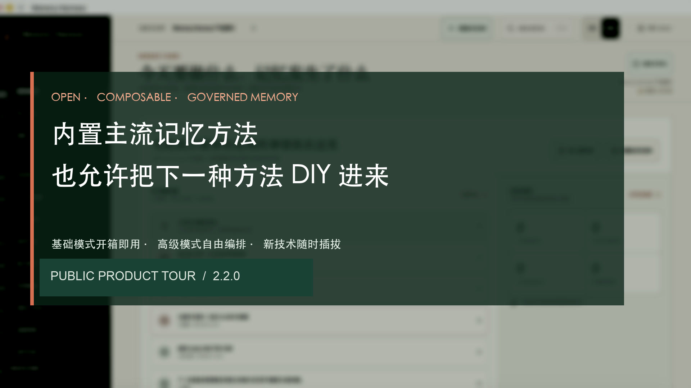
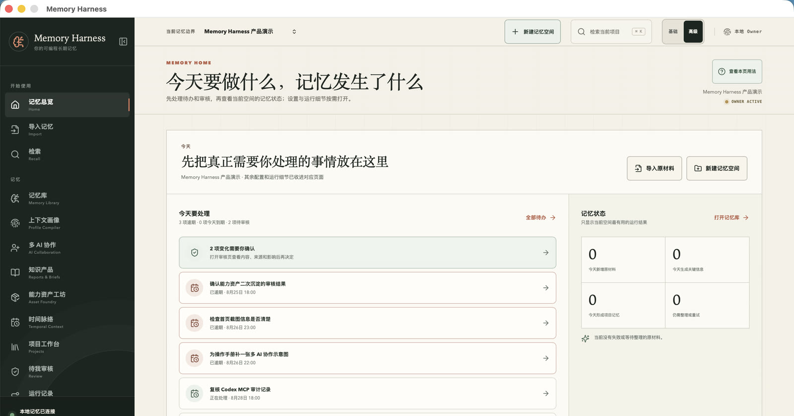
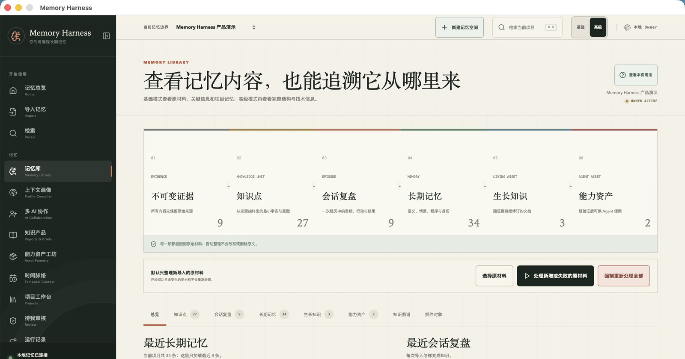
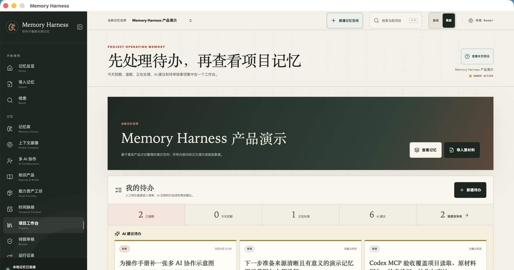
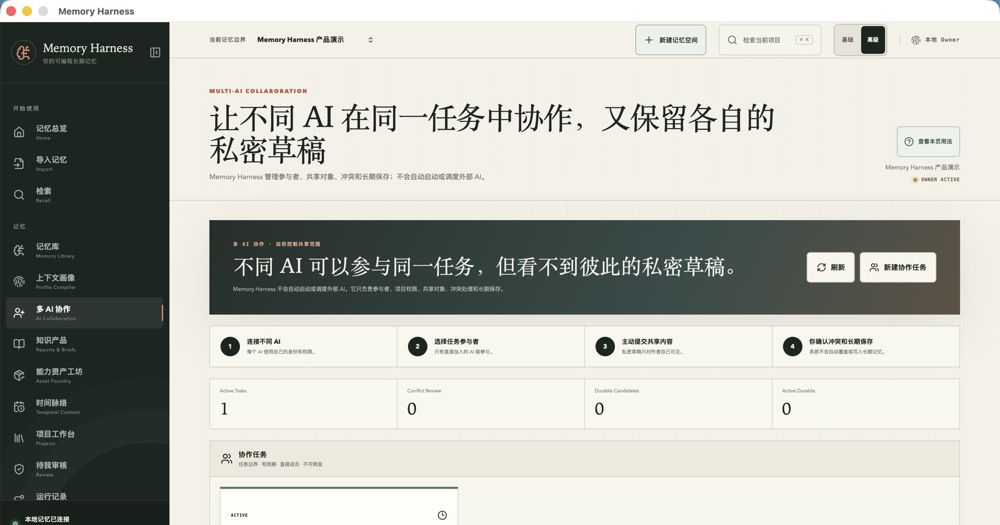
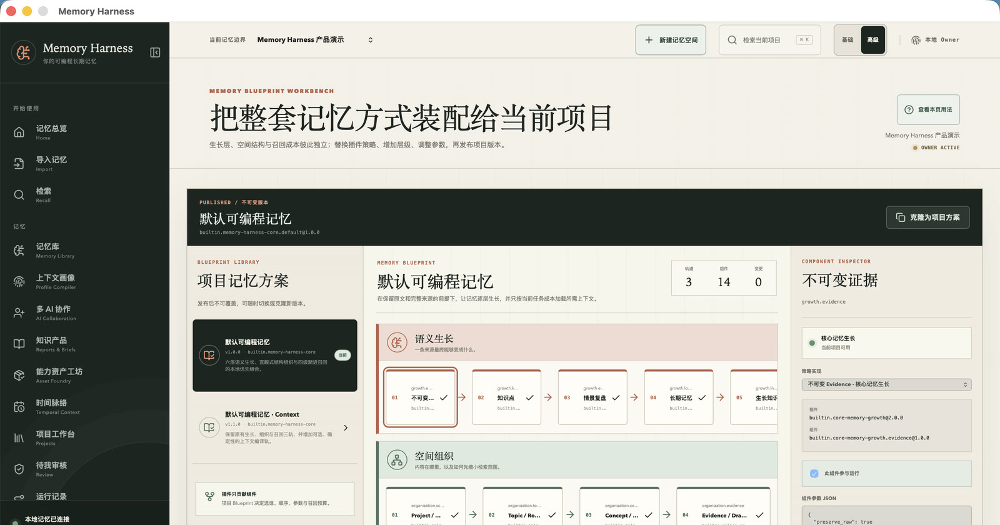
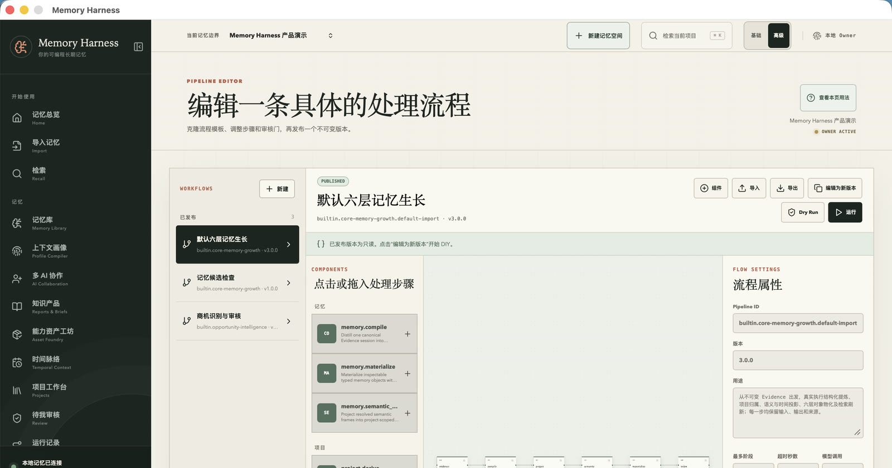
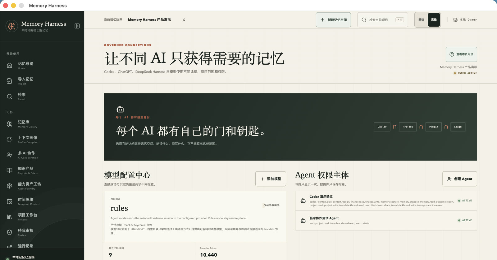
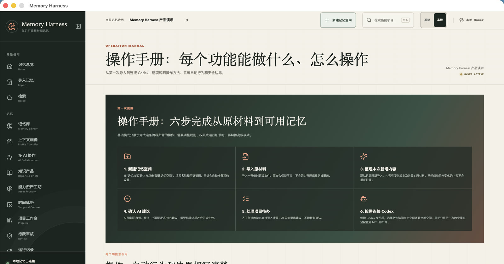

# Memory Harness

**本地优先、可编排、可审计的长期记忆工作台。** 让人和不同 AI 在同一个项目边界内保存原材料、沉淀长期记忆、检索来源、处理待办，并按需 DIY 自己的记忆流程。

[](https://github.com/luoyif/memory-harness/releases)
[](https://github.com/luoyif/memory-harness/actions/workflows/ci.yml)
[](LICENSE)

[English](#english) · [中文使用手册](docs/USER_GUIDE.zh-CN.md) · [MCP 接入](docs/MCP.md) · [权限说明](docs/PERMISSIONS.md) · [安全说明](SECURITY.md)

<p align="center">
  <a href="https://github.com/luoyif/memory-harness/releases/download/v2.2.0/Memory-Harness-2.2.0-product-tour-zh-CN.mp4">
    
  </a>
</p>

<p align="center">
  <a href="https://github.com/luoyif/memory-harness/releases/download/v2.2.0/Memory-Harness-2.2.0-product-tour-zh-CN.mp4">▶ 观看两分钟中文功能导览</a>
  ·
  <a href="https://github.com/luoyif/memory-harness/releases">下载 Windows / macOS 完整包</a>
</p>

> 当前版本：**2.2.0 Public Preview**。Windows x64 和 Intel macOS 已有真实运行验收；macOS 安装包包含 Intel 与 Apple Silicon 两种架构，但 Apple Silicon 本轮仅完成结构校验。公开包尚未使用 Apple Developer ID、公证或 Windows Authenticode 签名，系统可能显示安全提示。请先阅读 Release 中的安装说明。

## 它解决什么问题

普通聊天记录会不断变长，也很难回答“这条结论从哪里来、现在还有效吗、哪个 AI 可以看到”。Memory Harness 把这件事拆成一条可查看、可回溯的链路：

```text
导入原材料 → 提取关键信息 → 形成复盘 → 沉淀长期记忆 → 生成知识产品或能力资产
```

- **原材料不改写**：对话和文件作为不可变 Evidence 保存，派生结果可以重建。
- **默认适合新手**：基础模式只展示导入、检索、待办和确认；高级模式再开放流程、插件和模型配置。
- **记忆不是黑盒**：每层都能回到来源，受保护内容必须由 Owner 审核。
- **允许 DIY**：Blueprint、Pipeline、插件和类型合同可以替换或扩展记忆处理方式。
- **多 AI 有边界**：每个 Agent 有独立身份、项目授权和权限；私密草稿不会自动共享。
- **本地优先**：SQLite、JSONL、FTS 和本地嵌入都在设备上；只有主动启用模型模式时，选中的原材料才会发送到所配置的模型服务。

## 界面导览

<table>
  <tr>
    <td width="50%">
      <a href="docs/media/01-memory-overview.jpg"></a><br>
      <strong>先看到今天要做什么</strong><br>
      首页集中展示待办、审核和当前记忆状态，并提供新建空间与导入入口。
    </td>
    <td width="50%">
      <a href="docs/media/02-memory-library.jpg"></a><br>
      <strong>从原材料到可复用能力</strong><br>
      六层结果都能追溯来源；默认只处理新增、变化或失败的原材料。
    </td>
  </tr>
  <tr>
    <td width="50%">
      <a href="docs/media/03-project-workspace.jpg"></a><br>
      <strong>在项目里处理待办和建议</strong><br>
      人工待办直接生效，AI 行动项先进入建议区，由用户确认后再执行。
    </td>
    <td width="50%">
      <a href="docs/media/04-ai-collaboration.jpg"></a><br>
      <strong>多 AI 协作，但草稿彼此隔离</strong><br>
      只有主动提交的内容会共享；冲突和长期保存仍由 Owner 决定。
    </td>
  </tr>
  <tr>
    <td width="50%">
      <a href="docs/media/05-strategy-blueprint.jpg"></a><br>
      <strong>整套记忆方式可以 DIY</strong><br>
      内置主流记忆方案开箱即用，也可以替换层级、策略、参数与插件。
    </td>
    <td width="50%">
      <a href="docs/media/06-pipeline-studio.jpg"></a><br>
      <strong>每一条处理流程也可以 DIY</strong><br>
      自定义导入、提取、验证和写入步骤，先 Dry Run，再发布不可变版本。
    </td>
  </tr>
  <tr>
    <td width="50%">
      <a href="docs/media/07-models-and-agents.jpg"></a><br>
      <strong>模型和 Agent 分开配置</strong><br>
      Codex、ChatGPT 与其他 Agent 使用独立身份、项目范围和最小权限。
    </td>
    <td width="50%">
      <a href="docs/media/08-operation-manual.jpg"></a><br>
      <strong>不会用时，应用内直接查看</strong><br>
      操作手册说明每个功能能做什么、怎么操作、系统会做什么以及安全边界。
    </td>
  </tr>
</table>

## 主要能力

- 项目/记忆空间隔离，支持 Inbox 与 Personal 默认空间；
- 文本、Markdown、ChatGPT、Claude、DeepSeek 和规范化 JSON 导入；
- 只处理本次新增、失败或用户选中的原材料，避免旧材料被隐式全量重跑；
- 六层可追溯记忆：Evidence、Knowledge Unit、Episode、Memory、Living Knowledge、Agent Asset；
- 项目待办：人工待办直接生效，AI 只能提出建议，不能绕过确认；
- 时间脉络与 as-of 检索，区分发生时间、有效时间和记录时间；
- 知识产品、能力资产模板、二次沉淀、验证、Revision、Diff、回滚与审核；
- 多 AI 协作任务、作者私密草稿、直接共享、冲突审核和不可转发约束；
- OpenAI Responses、OpenAI-compatible Chat Completions、Anthropic Messages 与 OpenCode Go 混合协议模型；
- 24 个受权限控制的 MCP 工具，以及 HTTP 能力清单与审计记录；
- Doctor、索引重建、校验和导出、安全恢复和运行轨迹。

## RAG 与 Embedding 到底支持什么

2.2.0 的统一检索是可离线运行的混合 RAG：

1. 英文、代码和一般文本使用 SQLite FTS5 `unicode61` BM25；
2. 中文使用 FTS5 trigram BM25；
3. 每份可检索内容生成 `local-feature-hash-v1`、384 维的本地特征嵌入；
4. 关键词、嵌入相似度、时间相关性和新近度通过 RRF 融合；
5. 返回结果包含项目、来源、时间、评分和可精确读取的 Evidence 标识。

本地特征嵌入不需要下载模型、不调用外部服务，也不需要单独部署向量数据库。它能补足拼写变化、词形变化和局部文本相似检索，但**不冒充云端语义 Embedding 模型**。向量只是可重建索引；原始 Evidence 仍是权威来源。`memoryosd doctor` 会检查 FTS 与嵌入投影的数量、算法、维度和载荷。

## 下载并运行

打开 [Releases](https://github.com/luoyif/memory-harness/releases)，下载自己平台的 **2.2.0 完整包**：

- macOS：`Memory-Harness-2.2.0-macos-universal.zip`
- Windows x64：`Memory-Harness-2.2.0-windows-x64.zip`

完整包同时包含桌面安装程序、`memoryosd` MCP/命令行伴侣、安装说明和 SHA-256。不要只复制应用程序后就期待 MCP 命令自动出现。

首次打开后：

1. 在“记忆总览”新建记忆空间；
2. 导入一份对话或文件；
3. 处理新增原材料；
4. 在“待我审核”确认 AI 建议；
5. 在“检索”里搜索并点开来源；
6. 需要 Codex 或其他 AI 时，再到“连接与健康”创建 Agent。

详细步骤见 [中文使用手册](docs/USER_GUIDE.zh-CN.md)。

## Codex / MCP 快速接入

桌面端是 Owner 管理界面；`memoryosd` 在本机回环地址提供受权限控制的 MCP/HTTP 服务。Release 完整包已包含该伴侣程序。

1. 启动本机服务：

   ```bash
   memoryosd start --addr 127.0.0.1:19777
   ```

2. 在应用的“连接与健康”中创建独立 Codex Agent，选择项目和权限，并保存只显示一次的 Token。
3. 在 Codex 的 MCP 配置中使用：

   ```json
   {
     "mcpServers": {
       "memory-harness": {
         "command": "/absolute/path/to/memoryosd",
         "args": ["mcp", "--endpoint", "http://127.0.0.1:19777"],
         "env": {"MEMORYOS_AGENT_TOKEN": "<configure-in-secret-storage>"}
       }
     }
   }
   ```

Token 不应写入源码、说明文档、日志、聊天内容或 Evidence。Agent 不能删除原材料、批准自己的建议或绕过 Owner 激活能力资产。完整工具表见 [docs/MCP.md](docs/MCP.md)。

## 从源码构建

要求：Go 1.25.13+、Node.js 22+、Wails 2.12。`go.mod` 固定最低 Go 补丁版本，因为更旧的标准库包含本项目可达路径中的已知漏洞。

```bash
make test
make build
./bin/memoryosd version
./bin/memoryosd doctor --home ./runtime-data

cd frontend
npm ci
npm run typecheck
npm run lint
npm test
npm run build
```

桌面开发：

```bash
wails dev
```

默认数据目录是 `~/Documents/Knowledge/MemoryOS`。开发和测试请使用独立 `--home`，不要把演示数据写入正式记忆库。

## 安全边界

- HTTP/MCP 默认只监听 `127.0.0.1`；
- Owner 会话与 Agent Token 分离，每次调用重新检查权限和项目范围；
- 模型密钥使用系统密钥存储或明确的 secret reference，不回显；
- 导出带校验和，恢复拒绝非空目标、路径穿越和不认识的文件；
- Release 当前未做商业代码签名/公证，这是 Public Preview，不是无提示安装体验。

发现安全问题请按 [SECURITY.md](SECURITY.md) 私下报告，不要在公开 Issue 中附带 Token、个人记忆或数据库。

## 开源协议

Memory Harness 使用 [Apache License 2.0](LICENSE)。第三方依赖仍遵循各自许可证。

---

## English

Memory Harness is a local-first, programmable and auditable long-term memory workspace for people and AI agents. It keeps immutable source Evidence separate from rebuildable interpretations, provides project-scoped hybrid retrieval, human review, tasks, temporal context, governed agent assets and least-privilege MCP access.

Version 2.2.0 combines SQLite FTS5 BM25, a deterministic 384-dimensional local feature embedding, temporal relevance and recency through reciprocal-rank fusion. The local embedding is dependency-free and rebuildable; it is not presented as a hosted semantic embedding model and does not require a vector database.

Download a platform bundle from [Releases](https://github.com/luoyif/memory-harness/releases). Each 2.2.0 bundle contains the desktop installer, the `memoryosd` MCP companion, instructions and checksums. Windows x64 and Intel macOS are runtime-tested. The macOS binary is universal, but this round does not include real Apple Silicon hardware validation. Public preview artifacts are not Developer ID/notarized or Authenticode-signed.

See the [Chinese user guide](docs/USER_GUIDE.zh-CN.md), [MCP guide](docs/MCP.md), [API](docs/API.md) and [security policy](SECURITY.md).
